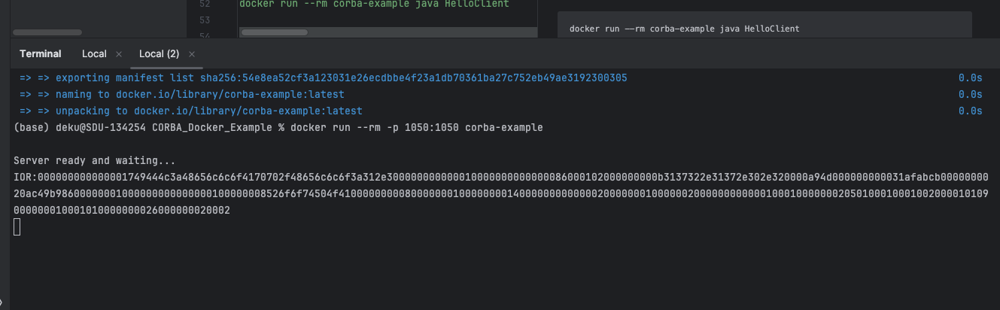

# CORBA Server and Client Example
This project demonstrates a simple CORBA server and client communication. The server is bound to a Naming Service, and the client uses the Naming Service to look up and interact with the server.

# Requirements
* Docker
* Java Development Kit (JDK) 8 or higher but should be <11


## Code structure/

* ├── Dockerfile           # Dockerfile for building the image
* ├── Hello.idl            # CORBA Interface Definition Language (IDL) file
* ├── HelloImpl.java       # Server implementation
* ├── HelloClient.java     # Client implementation
* ├── HelloServer.java     # Server entry point
* ├── pom.xml              # Maven configuration (if needed)
* └── README.md            # This file


# Build and Run with Docker
Follow these steps to build and run the CORBA server and client inside Docker.

## Step 1: Build the Docker Image

1. Clone this repository or navigate to the project directory.
2. Build the Docker image using the following command:

    ```
     docker build -t corba-example .
    ```
   
  This will build the Docker image, installing Java and copying necessary files.

# Step 2: Run the CORBA Server
1. The server will be bound to a Naming Service, and the object will be available for clients to resolve and interact with.
2. To run the server, execute the following command:
   ```
   docker run --rm -p 1050:1050 corba-example
   ```
This will expose port 1050 of the container, allowing clients to connect to the CORBA server.


# Step 3: Run the CORBA Client

* Once the server is running, the client can be executed to communicate with the server. 
## Before that 
 * Copy the full IOR string  that server prints on console (including the IOR:) and copy it on the client code  'orb.string_to_object'

* To run the client, execute:
```
docker run --rm corba-example java HelloClient

```

* The client will resolve the object from the Naming Service using the name IOR and invoke the sayHello() method.

# Example Output
 ## Server Output:

```
Server ready and waiting...
```

# Client Output:

```angular2html
Hello, CORBA in Docker!
```